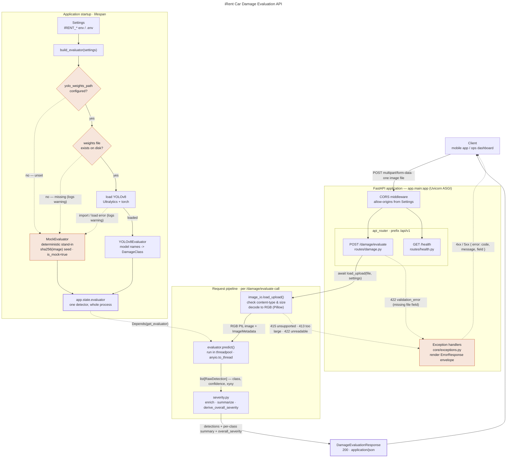

# iRent Car Damage Evaluation API

## Introduction

**iRent Car Damage Evaluation API** is a computer-vision service that inspects a photo of a
rental vehicle and reports the damage it finds. It was built for the Hotai (和泰) AI
hackathon around the iRent car-sharing workflow, where a vehicle changes hands many times a
day with no staff present. Today that hand-over relies on the customer and the operator
eyeing the car and, often, arguing about whether a scratch was already there. This API turns
that judgement call into a consistent, reviewable, machine-generated assessment.

Given one image (`multipart/form-data`), the service returns:

- **Detections** — each area of damage as a labelled box: a damage class
  (`scratch`, `dent`, `crack`, `glass_shatter`, `lamp_broken`, `tire_flat`, `missing_part`,
  `paint_chip`), a confidence score, a pixel bounding box, and a per-detection severity.
- **A summary** — how many detections there were and a count per damage class.
- **An overall severity** — one of `none` / `minor` / `moderate` / `severe`, derived from the
  worst detection and escalated when damage is widespread. This is the field an app or an
  ops dashboard can act on directly.

### How it works

Detection is powered by a **YOLOv8 (Ultralytics)** model, loaded once at startup from a
configurable weights path. Severity is layered on top by a small, transparent rules table
(`app/services/severity.py`) rather than the model, so the business definition of "severe"
can be tuned without retraining.

Until a damage-trained model is supplied, the service runs with a **built-in deterministic
mock detector**: it returns stable, plausible-looking results for any image so the entire
API surface — schemas, validation, error envelope, Swagger docs — is usable and testable
immediately. Swapping in real weights is a one-line config change with no code edits; if the
weights are missing or fail to load, the service logs a warning and falls back to the mock
detector rather than failing to start.

### Status

This repository is a working **scaffold**: the FastAPI application, Pydantic request/response
schemas, upload validation, error handling, the detector abstraction, and a passing test
suite are all in place. What remains for production use is a car-damage-trained YOLOv8 model
and any deployment concerns (auth, storage, rate limiting) the hackathon scope did not call
for.

## Endpoints

| Method | Path                       | Description                              |
| ------ | -------------------------- | ---------------------------------------- |
| GET    | `/api/v1/health`           | Service status + which detector is loaded |
| POST   | `/api/v1/damage/evaluate`  | `multipart/form-data` with one image `file` |
| GET    | `/docs`                    | Swagger UI                               |

### `POST /api/v1/damage/evaluate`

Request: `multipart/form-data`, field `file` = one JPEG / PNG / WebP image.

Response `200` (`DamageEvaluationResponse`):

```json
{
  "request_id": "0f8b3c2e-1c4a-4b6e-9a1d-2f5c9d3e7a11",
  "image": { "filename": "front.jpg", "content_type": "image/jpeg",
             "width": 1280, "height": 720, "size_bytes": 245678 },
  "detections": [
    { "damage_class": "dent", "confidence": 0.87, "severity": "moderate",
      "bounding_box": { "x1": 120.0, "y1": 80.5, "x2": 340.0, "y2": 220.0 } }
  ],
  "summary": { "total_detections": 1, "counts_by_class": { "dent": 1 }, "max_confidence": 0.87 },
  "overall_severity": "moderate",
  "model_name": "mock-detector", "model_version": "0.1.0",
  "is_mock": true, "inference_ms": 3.4
}
```

Errors use one envelope: `{ "error": { "code", "message", "field" } }` — `415`
unsupported type, `413` too large, `422` unreadable image / missing file.

## Quick start

```bash
python -m venv .venv
.venv\Scripts\activate            # Windows;  source .venv/bin/activate on macOS/Linux

# Light install (mock detector only, no torch):
pip install fastapi "uvicorn[standard]" pydantic pydantic-settings python-multipart pillow anyio

# ...or full install for real YOLOv8 inference + dev tooling:
pip install -r requirements-dev.txt

uvicorn app.main:app --reload
```

Then open <http://127.0.0.1:8000/docs>, or:

```bash
curl -F "file=@car.jpg" http://127.0.0.1:8000/api/v1/damage/evaluate
```

## Using a real YOLOv8 model

Set the weights path (env var or `.env`, see `.env.example`):

```
IRENT_YOLO_WEIGHTS_PATH=./weights/car_damage.pt
```

On startup the service loads that model; if the file is missing or fails to load it logs a
warning and falls back to the mock detector. The model's class labels are matched
case-insensitively against `DamageClass` in `app/schemas/common.py` — update that enum to
match your trained model's `names`.

Config is via `IRENT_`-prefixed env vars: `IRENT_YOLO_CONFIDENCE_THRESHOLD`,
`IRENT_YOLO_IOU_THRESHOLD`, `IRENT_YOLO_DEVICE`, `IRENT_MAX_IMAGE_BYTES`,
`IRENT_ALLOWED_CONTENT_TYPES`, `IRENT_CORS_ALLOW_ORIGINS`.

## Project layout

```
app/
  main.py            FastAPI app factory + lifespan (loads the detector once)
  config.py          Settings (pydantic-settings)
  api/               routers, dependencies
  schemas/           Pydantic request/response models
  services/
    image_io.py      upload validation -> PIL image + metadata
    evaluator.py     DamageEvaluator ABC, YOLOv8Evaluator, MockEvaluator, build_evaluator()
    severity.py      per-detection + overall severity derivation
  core/exceptions.py application errors + handlers
tests/               pytest suite (runs against the mock detector)
```

## Tests

```bash
pip install -r requirements-dev.txt
pytest
ruff check .
```

## System Architecture
